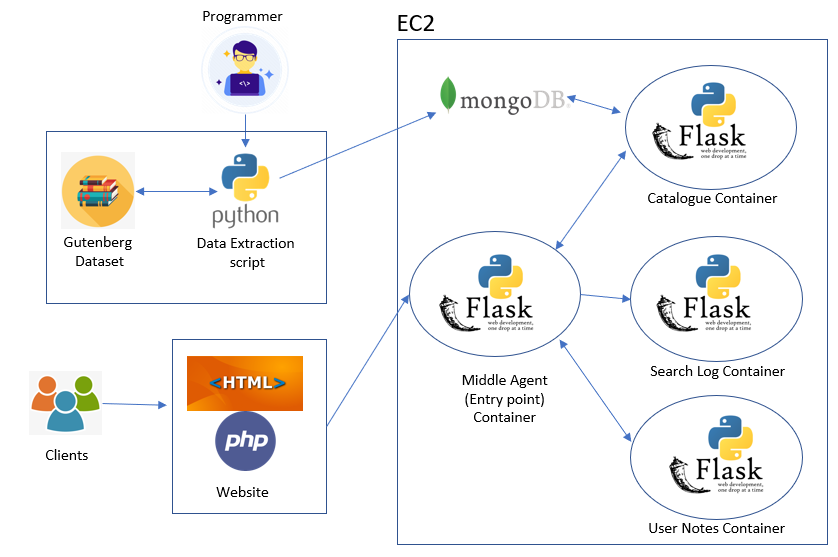

# Book-Notes

A simple web application that lets the user search for books and authors from a Gutenberg dataset stored in Mongo DB and hosted in AWS EC2.
It uses three APIs developed using Flask framework to fulfill the information needs of the users. These APIs communicate with each other and are deployed on multiple docker containers on AWS EC2 using docker-compose.
The front-end of the web application is created using HTML/CSS and the PHP is used for the backend.

A video demonstration can be found under 'Images'. (**Images/Docker demo.mp4**)

**Architecture**

**Docker Containers List**

**Communication**

